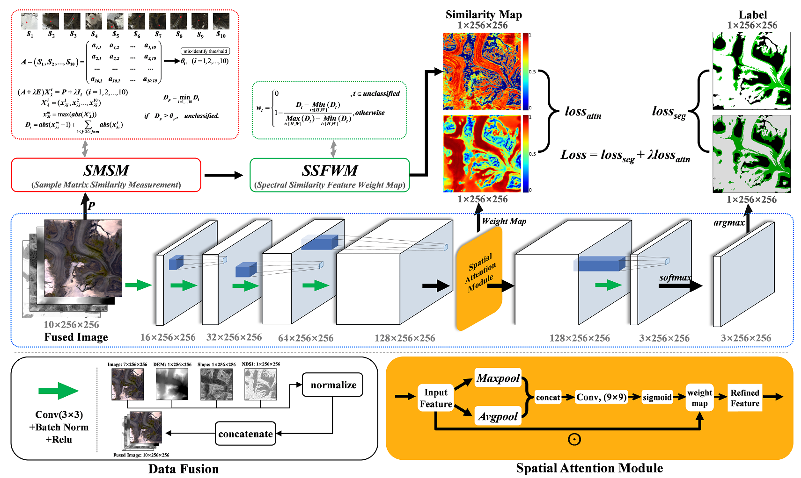

# SSMGNet — Spectral Similarity Measurement Guided attention mechanism Network

This repository implements SSMGNet (Spectral Similarity Measurement Guided attention mechanism Network) for semantic segmentation (example use: glacier extraction).  
It combines a simple cnn segmentation network (SegModel) with an attention supervision signal computed from spectral sample references. The attention supervision is generated by `utils/sf_cnm_threshold.py` and used during training to improve model focus on spectrally-similar pixels.



---

## 📃 Code Contents
- utils/
- model/
- figure/
- dataset/
- pth_files/
- test_sample/
- output/
- train.py
- predict_small.py
- predict_huge.py
- Structure.py

---

## 🎯 Quick features
- ⚡️ Spectral-similarity based attention supervision (computed from spectral sample matrix)
- 🔄 Training uses segmentation loss (Cross-Entropy / Focal) + attention MSE loss
- 🚀 Small-patch and large-image inference scripts (GeoTIFF I/O)
- 🌐 Export predictions to GeoTIFF and shapefile (predict_huge.py uses rasterio + geopandas)
- 🏆 Deterministic seed setup for reproducibility
- ❄️ Specialized support for glacier segmentation tasks

---

## ⚙ Requirements and Environments
```
torch==2.3.0+cu121
torchvision==0.18.0+cu121
torchaudio==2.3.0+cu121
torchinfo==1.8.0
torchsummary==1.5.1
numpy==1.26.4
pandas==2.3.3
tqdm==4.67.1
timm==1.0.24
GDAL==3.9.2
rasterio==1.4.4
geopandas==1.1.2
shapely==2.1.2
opencv-python==4.12.0.88
matplotlib==3.10.8
```

**Install pytorch (CUDA version)**
***Note***
- pip install torch==2.3.0+cu121 torchvision==0.18.0+cu121 torchaudio==2.3.0+cu121 --index-url https://download.pytorch.org/whl/cu121

**Install other dependency package**
***Note***
- pip install -r requirements.txt

---

## 📁 Dataset layout
train.py expects a dataset root with annotation lists:
```
DATASET_PATH/
├─ annotations/
│   ├─ train.txt   # list of training samples (see utils/dataset.py for exact required format)
│   └─ val.txt     # list of validation samples
├─ images/
└─ labels/
```
Check `utils/dataset.py` to confirm how each line in the txt files should be formatted (relative paths, paired image/label format, normalization, etc.).

---

## Training  (train.py)

Overview:
- The script prepares a segmentation model `SegModel`, loads optional pretrained weights, prepares optimizer and scheduler, computes spectral misclassification thresholds from a reference spectral matrix (`ill_cond_A`), then trains using both segmentation and attention supervision losses.
- Training metrics are logged to `metric_training_log.csv`.
- Model checkpoints (state_dict) are saved to `pth_files/` as `epoch{n}-loss{train_loss:.3f}-val_loss{val_loss:.3f}.pth`.

Example command (single GPU):
```bash
python train.py \
  --DATASET_PATH ./datasets \
  --MODE single \
  --GPU_ID 0 \
  --BANDS 10 \
  --NUM_CLASS 3 \
  --BATCH_SIZE 8 \
  --EPOCHS 50 \
  --SEGMODEL_PRETRAIN ./SegModel_pretrained.pth \
  --LOSS_TYPE ce \
  --OPTIMIZER_TYPE adam \
  --LR_SCHEDULER step \
  --INIT_LR 5e-3 \
  --INIT_TYPE kaiming
```

Multi-GPU example (select GPUs):
```bash
python train.py --MODE muti --GPU_LIST "0,1" --DATASET_PATH ./datasets ...
```

Important flags (defaults shown in train.py):
- DATASET_PATH: ./datasets/
- MODE: single | muti | all (default: single)
- GPU_ID: 0
- GPU_LIST: '1,2' (string, parsed when MODE==muti)
- BANDS: 10
- NUM_CLASS: 3 (script default is 2+1)
- INIT_LR: 5e-3
- BATCH_SIZE: 8
- START_EPOCH: 1
- EPOCHS: 8
- SEGMODEL_PRETRAIN: SegModel_pretrained.pth
- LOSS_TYPE: ce | focal
- OPTIMIZER_TYPE: adam | sgd
- LR_SCHEDULER: step | poly | cos | exp
- INIT_TYPE: kaiming | normal | xavier | orthogonal

Training specifics:
- Random seed is fixed at the beginning via set_seed(42) (affects random, numpy, torch).
- A spectral sample matrix `ill_cond_A` (10x10 by default in train.py) is used to compute `mis_threshold = Get_Mis_Threshold(ill_cond_A)` (torch tensor).
- Per-batch attention supervision:
  - `att_lbl1, _ = Compute_Attention_Label(img, Matrix, threshold)` → `att_lbl1` is [B,1,H,W], a similarity confidence map in [0,1].
  - Model returns (output, _, w4) where `w4` is the learned attention map at a resolution matching `att_lbl1`.
  - Segmentation loss: CrossEntropyLoss (with class weights) or FocalLoss.
  - Attention loss: MSELoss between `w4` and `att_lbl1`.
  - Combined loss: seg_loss + weight_value * att_loss. `weight_value` is initialized to 6 and halved every 10 epochs in the script.
- Optimizers: Adam or SGD. Scheduler: StepLR, ExponentialLR, CosineAnnealingLR or PolynomialLR.

Logs & checkpoints:
- Training metrics appended to `metric_training_log.csv`. Columns include epoch, train_loss, train_atten, val_loss, val_atten, Acc, Kappa, mIoU, per-class IoU, FWIoU, Precision, Recall, F1, F2, etc.
- Checkpoints saved to `pth_files/` using `torch.save(model.state_dict(), ...)`.

---

## 💡 Attention supervision  (utils/sf_cnm_threshold.py)

This module supplies two functions used in training:

1. Get_Mis_Threshold(Matrix)
   - Input: `Matrix` (numpy array) — spectral sample matrix (example: 10×10 in code).
   - Computes a per-class threshold vector used to determine whether a pixel's spectral match to a reference is reliable.
   - Output: `mis_threshold` (torch tensor, length = number of columns).

2. Compute_Attention_Label(img, Matrix, threshold)
   - Inputs:
     - img: torch.Tensor, shape [B, C, H, W] (pixel values must be on same scale used for Matrix)
     - Matrix: numpy array or torch-convertible spectral matrix
     - threshold: output from Get_Mis_Threshold (torch.Tensor)
   - Computes per-pixel distance to all spectral references using a perturbed linear-solve approach, applies thresholding to determine valid matches, and normalizes distances into a similarity/confidence score in [0,1].
   - Outputs:
     - similar_lbl: torch.Tensor [B, 1, H, W] (attention confidence map)
     - label_map: torch.LongTensor [B, H, W] (0 = invalid / no match, >0 = class index)

How to customize spectral references:
- Replace the `ill_cond_A` matrix defined in `train.py` with your own spectral references (each column representing one reference spectrum). Ensure the shape matches `BANDS`.

Notes:
- If many pixels are marked invalid (all zeros), check scales, noise, and that `ill_cond_A` matches spectral bands.

---

## Inference

### predict_small.py (small patch inference)
- Purpose: run inference on small images / patches; save classification GeoTIFF, visualization PNG and Grad-CAM / attention heatmaps.
- Default behavior: in `__main__` there are example paths for `model_path` and `img_in_path` — edit these or modify the script to accept CLI args.
- Outputs:
  - `./output/seg_{img_name}_class.tif` — one-band class map
  - `./output/seg_{img_name}_png.tiff` — RGB visualization
  - `./figure/gradcam_heat.tif`, `./figure/learned_attent_heat.tif`, and a single-channel Grad-CAM TIFF.

Run:
```bash
python predict_small.py
```

Note: predict_small uses a `Model` from `Structure` module — ensure that `Structure.Model` can load the checkpoint saved by train.py (state_dict format).

### predict_huge.py (large image inference + shapefile)
- Purpose: run inference on large images, save GeoTIFF and optionally convert non-zero class regions to a shapefile.
- Outputs:
  - `./output/seg_{img_name}_class.tif`
  - `./output/seg_{img_name}_png.tiff`
  - `./output/shape/{seg_{img_name}_class.shp}` (created by raster_tif_to_shp)
- Default behavior: paths set in `__main__`, edit or adapt to CLI.

Run:
```bash
python predict_huge.py
```

Notes:
- `raster_tif_to_shp` maps class values to labels (default: 1→clean_glacier, 2→debris_glacier). Edit `label_map` in the script if your classes differ.
- Requires `rasterio` and `geopandas`.

---

## Comparative models
You may compare SSMGNet to common segmentation baselines (trained under comparable conditions):
- **`FCN`**  
  **Fully Convolutional Networks for Semantic Segmentation (Jonathan Long et al., 2015, CVPR).**  
  Paper: [arXiv:1411.4038 (PDF)](https://arxiv.org/pdf/1411.4038).

- **`U-Net`**  
  **U-Net: Convolutional Networks for Biomedical Image Segmentation (Olaf Ronneberger et al., 2015, MICCAI).**  
  Paper: [arXiv:1505.04597 (PDF)](https://arxiv.org/pdf/1505.04597).

- **`SegNet`**  
  **SegNet: A Deep Convolutional Encoder-Decoder Architecture for Image Segmentation (Vijay Badrinarayanan et al., 2015, TPAMI).**  
  Paper: [arXiv:1511.00561 (PDF)](https://arxiv.org/pdf/1511.00561).

- **`ENet`**  
  **ENet: A Deep Neural Network Architecture for Real-Time Semantic Segmentation (Adam Paszke et al., 2016, arXiv).**  
  Paper: [arXiv:1606.02147 (PDF)](https://arxiv.org/pdf/1606.02147).

- **`RefineNet`**  
  **RefineNet: Multi-Path Refinement Networks for High-Resolution Semantic Segmentation (Guosheng Lin et al., 2017, CVPR).**  
  Paper: [arXiv:1611.06612 (PDF)](https://arxiv.org/pdf/1611.06612).

- **`PSPNet`**  
  **Pyramid Scene Parsing Network (Hengshuang Zhao et al., 2017, CVPR).**  
  Paper: [arXiv:1612.01105 (PDF)](https://arxiv.org/pdf/1612.01105).

- **`DeepLabv3`**  
  **Rethinking Atrous Convolution for Semantic Image Segmentation (Liang-Chieh Chen et al., 2017, CVPR).**  
  Paper: [arXiv:1706.05587 (PDF)](https://arxiv.org/pdf/1706.05587).

- **`DeepLabv3+`**  
  **Encoder-Decoder with Atrous Separable Convolution for Semantic Image Segmentation (Liang-Chieh Chen et al., 2018, ECCV).**  
  Paper: [arXiv:1802.02611 (PDF)](https://arxiv.org/pdf/1802.02611).

- **`UPerNet`**  
  **Unified Perceptual Parsing for Scene Understanding (Tete Xiao et al., 2018, ECCV).**  
  Paper: [arXiv:1807.10221 (PDF)](https://arxiv.org/pdf/1807.10221).

- **`HRNet`**  
  **Deep High-Resolution Representation Learning for Human Pose Estimation (Ke Sun et al., 2019, CVPR).**  
  Paper: [arXiv:1902.09212 (PDF)](https://arxiv.org/pdf/1902.09212).

- **`OCRNet`**  
  **Object-Contextual Representations for Semantic Segmentation (Yuhui Yuan et al., 2020, ECCV).**  
  Paper: [arXiv:1909.11065 (PDF)](https://arxiv.org/pdf/1909.11065).

- **`SETR`**  
  **Rethinking Semantic Segmentation from a Sequence-to-Sequence Perspective with Transformers (Sixiao Zheng et al., 2021, CVPR).**  
  Paper: [arXiv:2012.15840 (PDF)](https://arxiv.org/pdf/2012.15840).

- **`SegFormer`**  
  **SegFormer: Simple and Efficient Design for Semantic Segmentation with Transformers (Enze Xie et al., 2021, NeurIPS).**  
  Paper: [arXiv:2105.15203 (PDF)](https://arxiv.org/pdf/2105.15203).

- **`Mask2Former`**  
  **Masked-attention Mask Transformer for Universal Image Segmentation (Bowen Cheng et al., 2022, CVPR).**  
  Paper: [arXiv:2112.01527 (PDF)](https://arxiv.org/pdf/2112.01527).

- **`SegNeXt`**  
  **SegNeXt: Rethinking Convolutional Attention Design for Semantic Segmentation (Meng-Hao Guo et al., 2022, NeurIPS).**  
  Paper: [arXiv:2209.08575 (PDF)](https://arxiv.org/pdf/2209.08575).

---

## Example recommended workflow
1. Prepare dataset and ensure `annotations/train.txt` & `annotations/val.txt` match `utils/dataset.py` expectations.
2. Edit `train.py`:
   - Replace `ill_cond_A` with your spectral reference matrix (or modify code to read it from file).
   - Set desired hyperparameters (lr, epochs, batch size, loss type).
3. Train:
   ```bash
   python train.py --DATASET_PATH ./datasets --EPOCHS 100 --BATCH_SIZE 8 ...
   ```
4. Use the produced checkpoint in `pth_files/` for inference:
   ```bash
   python predict_small.py
   python predict_huge.py
   ```
5. Inspect `metric_training_log.csv` and exported GeoTIFF/shapefiles.

---

## Tips & debugging
- If attention maps are all zeros: check `ill_cond_A` and value ranges of input images.
- If model loading fails in `Structure.Model`: confirm `state_dict` vs full checkpoint format and adapt loading logic.
- If rasterio/geopandas installation fails, use conda-forge channel.

---

## Contact
- Maintainer: Lecheng Wang  
- Repository: https://github.com/Lecheng-Wang/SSMGNet
- E-mail:     wanglecheng521@163.com

---
